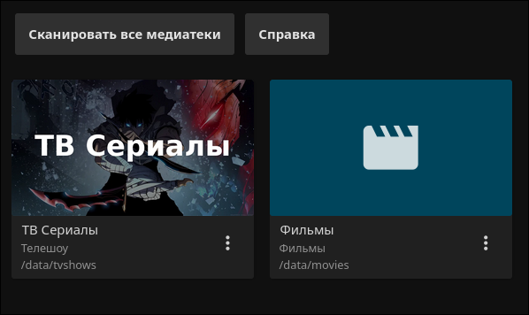
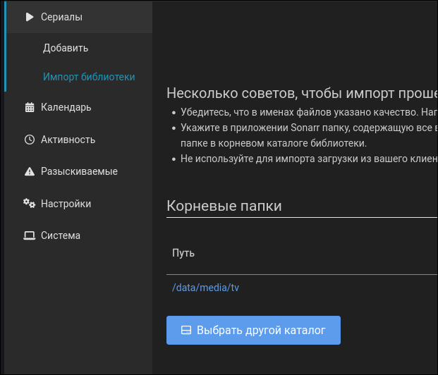
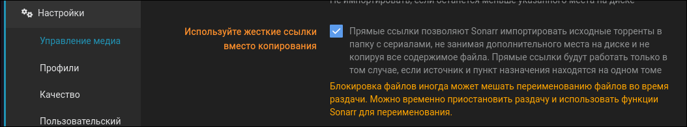
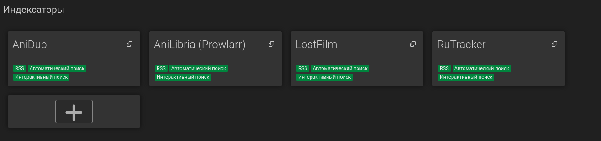
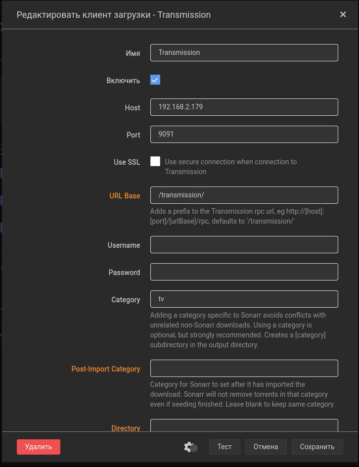
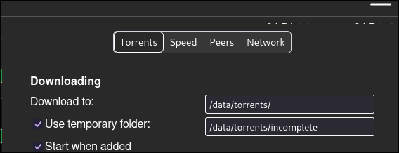

# Небольщой гайд по тому, как поднять собственный медиа сервер с авто загрузкой 

## Шаг 1: Установка Docker

Для начала, установим Docker, который позволит нам легко управлять контейнерами в нашем медиа сервере. Ознакомьтесь с тем, как сделать это на вашем дестребутиве\ос, для ubuntu это:

```bash
curl -fsSL https://get.docker.com -o get-docker.sh
sudo sh ./get-docker.sh --dry-run
```

## Шаг 2: Настройка медиа сервера

Создайте файл `compose.yml` в удобной для вас директории и добавьте в него следующий код:

```yaml
services:
  # Classic media library manager
  jellyfin:
    image: lscr.io/linuxserver/jellyfin:latest
    container_name: jellyfin
    environment:
      - PUID=1000
      - PGID=1000
      - TZ=Europe/Moscow
      - JELLYFIN_PublishedServerUrl=http://192.168.0.5 #optional
      - UMASK=002
    volumes:
      - /home/sklknn/Data/configs/Jellyfin:/config
      - /home/sklknn/Data/media/tv:/data/tvshows
      - /home/sklknn/Data/media/movies:/data/movies
    ports:
      - 8096:8096 # Http webUI
      - 8920:8920 # optional Https webUI (you need to set up your own certificate).
      - 7359:7359/udp # optional Allows clients to discover Jellyfin on the local network
      # - 1900:1900/udp # optional Service discovery used by DNLA and clients. if running on work machine - can conflict with other apps like spotify
    restart: unless-stopped
  # PVR for usenet and bittorrent users
  sonarr:
    image: lscr.io/linuxserver/sonarr:latest
    container_name: sonarr
    environment:
      - PUID=1000
      - PGID=1000
      - TZ=Europe/Moscow
      - UMASK=002
    volumes:
      - /home/sklknn/Data/configs/Sonarr:/config
      - /home/sklknn/Data:/data 
    ports:
      - 8989:8989 # web UI
    restart: unless-stopped
  # Sonarr but for movies
  radarr:
    image: lscr.io/linuxserver/radarr:latest
    container_name: radarr
    environment:
      - PUID=1000
      - PGID=1000
      - TZ=Europe/Moscow
      - UMASK=002
    volumes:
      - /home/sklknn/Data/configs/Radarr:/config
      - /home/sklknn/Data:/data
    ports:
      - 7878:7878 # web UI
    restart: unless-stopped
  # torrent queries parser
  jackett:
    image: lscr.io/linuxserver/jackett:latest
    container_name: jackett
    environment:
      - PUID=1000
      - PGID=1000
      - TZ=Europe/Moscow
      - AUTO_UPDATE=true #optional
      - RUN_OPTS= #optional
      - UMASK=002
    volumes:
      - /home/sklknn/Data/configs/Jackett:/config
      - /home/sklknn/Data/torrents:/data/torrents
    ports:
      - 9117:9117 # web UI
    restart: unless-stopped

  transmission:
    image: lscr.io/linuxserver/transmission:latest
    container_name: transmission
    environment:
      - PUID=1000
      - PGID=1000
      - TZ=Europe/Moscow
      - TRANSMISSION_WEB_HOME= #optional
      - USER= #optional user for web interface
      - PASS= #optional password for web interface
      - WHITELIST= #optional
      - PEERPORT= #optional
      - HOST_WHITELIST= #optional
      - UMASK=002
    volumes:
      - /home/sklknn/Data/configs/Transmission:/config
      - /home/sklknn/Data/torrents:/data/torrents #optional
      - /home/sklknn/Data/torrents/files:/watch #optional
    ports:
      - 9091:9091 # web UI
      - 51413:51413 # torrent port 
      - 51413:51413/udp # torrent port udp 
    restart: unless-stopped

  jellyseerr:
    image: fallenbagel/jellyseerr:latest
    container_name: jellyseerr
    environment:
      - LOG_LEVEL=debug
      - TZ=Europe/Moscow
      - PORT=5055 #optional
    ports:
      - 5055:5055
    volumes:
      - /home/sklknn/Data/configs/Jellyseerr:/app/config
    restart: unless-stopped
  #just for a test
  prowlarr:
    image: lscr.io/linuxserver/prowlarr:latest
    container_name: prowlarr
    environment:
      - PUID=1000
      - PGID=1000
      - TZ=Europe/Moscow
    volumes:
      - /home/sklknn/Data/configs/Prowlarr:/config
    ports:
      - 9696:9696
    restart: unless-stopped


```

Замените `/home/sklknn/Data/`, на путь к корневой директории медиа сервера. Перед запуском подготовьте вашу корневую директорию, создав папки по следующему шаблону.

```
data
├── torrents
│   ├── incomplete
│   ├── movies
│   └── tv
├── config
│   ├── Jackett
│   ├── Jellyfin
│   ├── Jellyseerr
│   ├── Prowlarr
│   ├── Radarr
│   ├── Sonarr
│   └── Transmission
└── media
    ├── movies
    └── tv
```

Прошу заметить, в конфигурации одновременно присутствуют и Prowlarr и Jackett, выполняющие одну и ту-же задачу. Если функционал одного решает все ваши задачи - можете убрать второй, но лично я столкнулся с ошибками индексеров внутри одного приложения, не возникающих внутри второго.

## Шаг 3: Запуск медиа сервера

Перейдите в директорию с файлом `docker-compose.yml` и выполните команду:

```bash
sudo docker compose up -d
```

## Шаг 4: Доступ к медиа серверу

После запуска медиа сервера, вы можете получить к нему доступ через веб-браузер, перейдя по адресу `http://<ip адресс хотса докера>:<Порт web UI каждого приложенмя>`. Следуйте инструкциям на экране для завершения настройки. 

## Шаг 5: Настройка важных приложений
### Jellyfin
Создайте 2(или более) медиатеки для фильмов и сериалов, как указано в конфигурации

Дальнейшие опшии на работоспособность вашей конфигурации не влияют

### Sonarr/Radarr
Опции внутри обоих приложений идентичны, повторите их внутри каждого соответственно.

В качестве корневой папки приложения выберите **/data/media/tv** для Sonarr и **/data/media/movies** для Radarr


Перейдите в раздел **Настройки** и включите **Расширенные настройки** , затем в категории управление медиа проверьте, что жесткие ссылки включены как опция.


В разделе индексаторы добавьте свои индексаторы из jackett вручную, либо за вас это автоматически сделает Prowlarr


В разделе клиенты загрузки добавьте Transmission, в качестве категории для sonarr укажите tv, а для radarr - movies.


### Transmission

В настройках установите пути загрузки: 


### Jackett/Prowlarr

Конфигурация этих приложений тривиальна, просто добавьте индексеры, и импортируйте их в Sonarr или Radarr автоматически(в настройках prowlarr)или руками(Jackett) - инструкция в веб интерфейсе

### Jelyseerr

Просто следуйте интсрукции установки

## Заключение

Теперь у вас есть работающий медиа сервер, который можно использовать для стриминга ваших медиа файлов. Вы можете автоматически заказывать новые фильмы\сериалы через jellyseerr, как только загрузка завершиться - можно будет увидеть готовые сериалы прямо в jellyfin, остальные приложения не требуют никакого взаимодействия после настройки