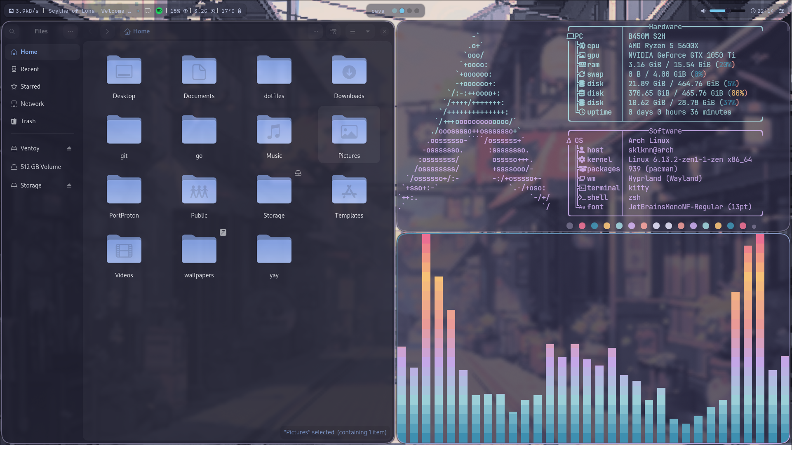
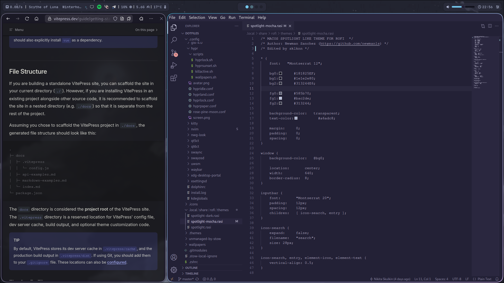
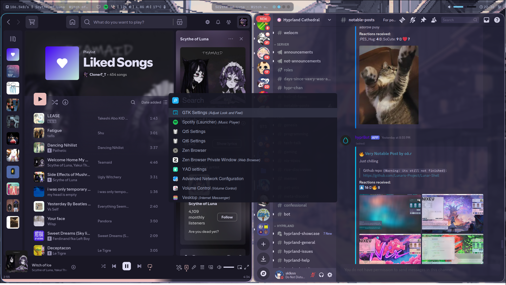
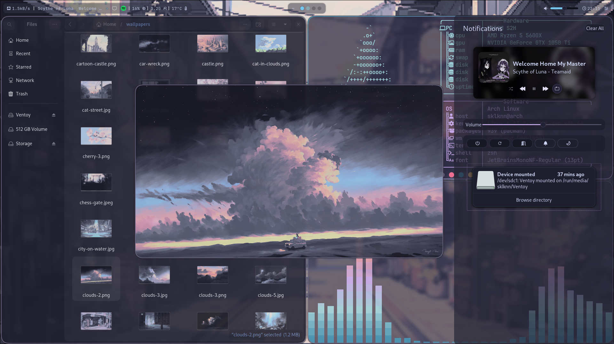

# Проекты

## Проект 1 : Личный сайт :sparkling_heart:
**Описание:** Личный сайт для того, чтобы выставить мои проекты, портфолио и резюме.

**Используемые технологии:** HTML, CSS, JavaScript, NPM, VitePress, MarkDown, Git, GitHub-Pages

**GitHub репозиторий:** [Ссылка](https://github.com/sklknn/sklknn.github.io)

::: details Подробнее
Сайт вы видите своими глазами прямо сейчас, пока читаете это. Страницы опираються на парсер MarkDown-HTML, преобразующий обычные .md фалый в полноценный статичный сайт. На GitHub Pages выстроен пайплайн, собирающий и поднимающий сайт при каждом входящем коммите в main ветку, почти CI/CD. Естественно, все кнопочки и оформление перекрашено в цвета моей любимый темы Rosé Pine. Вся документация для VitePress естественно доступна только на Английском, что подтверждает мой прекрасный уровень владения языком :wink:
:::

## Проект 2 : Личный сервер домашней автоматизации и IOT :100:
**Описание:** Домашний сервер, основанный на гипервизоре proxmox и open source приложениях.

**Используемые технологии:** Proxmox, KVM, Linux ,docker, docker-compose, MQTT, Zigbee

**GitHub репозиторий:** Увы, отсутствует, железо в гите не хранят :upside_down_face:

::: details Подробнее
Я сильно вдохновился возможностями, которые может предоставить домашний сервер. В первую очередь это естественно была централизация устройств IOT на платформе Home Assistant, возможность объединить китайскую 'умную' led ленту, свет от Xiaomi и Яндекс Алису в одном удобном приложении, при этом не выставляя свои данные сторонней компании, да еще и обрабатывая все запросы устройтсв локально - дорогого стоит.
Развернуть [медиа сервер](/guides/mediaserver) на jellyfin, на docker-compose, для автоматической обработки запросов и поиска на ~~торренте~~ локальной сети, и автоматической закачки - превращает любое устройство с приложением jellyfin - в портативный кинотеатр. При этом поддерживаеться локальный декодинг видео на самом сервере, при настроеном пробросе видеокарты в хост контейнера.
Ну и естественно, при наличии статического внешнего IP адреса, и для красоты жизни - доменного имени CloudFlare и nginx превращают все это домашнее изобилие - в изобилие доступное по всему миру.
А, ну еще можно поднять сервер по любой компьютерной игре для друзей, лично я поднимал minecraft, ark и space station 14. Как по мне - Debian > Ubuntu server, хотя для личного пользования я всё-равно выбираю Arch, об этом ниже.
:::

## Проект 3 : Arch Linux rice :alien:
**Описание:** Косметическое оформление более 20 разных приложений и утилит, для красоты и удобства личного пользования

**Используемые технологии:** Linux, BASH, CSS, JSON, и целая гора документации и чтения открытых исходников без документации :open_mouth:

**GitHub репозиторий:** [Ссылка](https://github.com/sklknn/dotfiles)

::: details Подробнее
Подобрать тему и оформление, собрать стак приложений вместе, ведь я пользуюсь WM а не DE, ну и естественно оснастить пустые версии приложений функционалом, а не только красивыми кнопочками (путем написания тонны BASH скриптов:skull:) - это все про riceing. Слова излишни, когда можно показать.

Темы работают и в консольных и в GUI приложениях, и не важно, QT или GTK

Ну и естественно,все это подкрепленно скриптом для автоматического развертывания всего этого великолепия на голой системе без всего.
:::